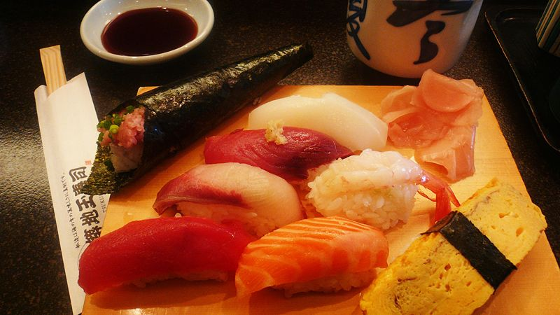

# Sushi Basics

In Japanese cuisine, sushi is vinegared rice, usually topped with other ingredients, including fish \(cooked or uncooked\) and vegetables.

The main idea in the preparation of sushi is the preservation and fermentation of fish with salt and rice, a process that has been traced back to Southeast Asia where fish and rice fermentation dishes still exist today. The science behind the fermentation of fish in rice is that the vinegar produced from the fermenting rice breaks the fish down into amino acids. This results in one of the five basic tastes, called umami in Japanese. The oldest form of sushi in Japan, Narezushi still very closely resembles this process. In Japan, Narezushi evolved into Oshizushi and ultimately Edomae nigirizushi, which is what the world today knows as sushi.

The common ingredient across all the different kinds of sushi is sushi rice \(known as shari in Japanese\). The variety in sushi arises from the different fillings and toppings, condiments, and the way these ingredients are put together. The same ingredients may be assembled in a traditional or a contemporary way, creating a very different final result:

-   Nigiri-zushi
-   Maki-zushi \(roll\)
-   Oshizushi
-   Chirashizushi
-   Narezushi \(old style fermented sushi\)
-   Temarizushi

